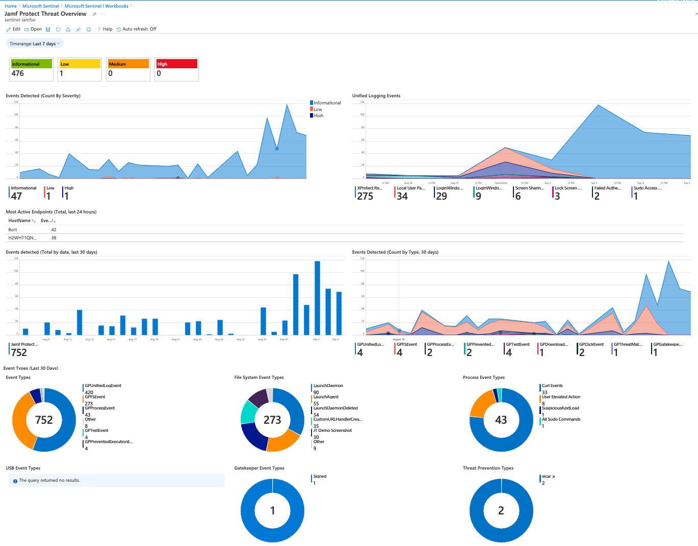

# Microsoft Azure Sentinel
The files contained in this repository provides example workbooks and queries for Microsoft Azure Sentinel with having Jamf Protect as data source.

**Steps to use example workbooks contained within this repository:**

1. Navigate to _https://portal.azure.com_
2. Navigate to Azure Sentinel
3. Navigate to the Sentinel Workspace that is being used for Jamf Protect
4. Navigate to Workbooks and continuing in My Workbooks
5. Click on + Add Workbook
6. Click Edit and in the button bar on the top navigate to the advanced editor `</>`
7. Copy and Paste all data below the # JSON Representation here
8. Once copied into Advanced Editor, hit CMD+F or CNTR+F and replace YOUR_PROTECT_SENTINEL_DATASOURCE with your Sentinel Data Source name
9. Hit Apply and Done Editing
10. You can now view or link to this dashboard by clicking View My Dashboard

## Please note that all resources contained within this repository are provided as-is and are not officially supported by Jamf Support.